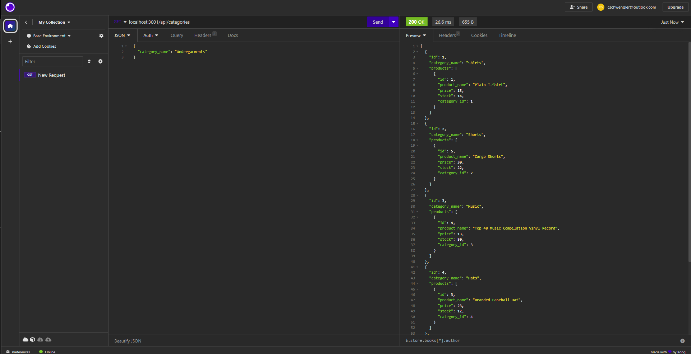
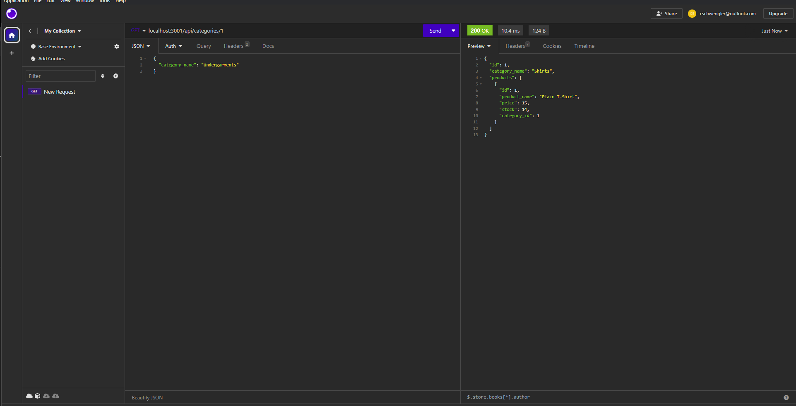
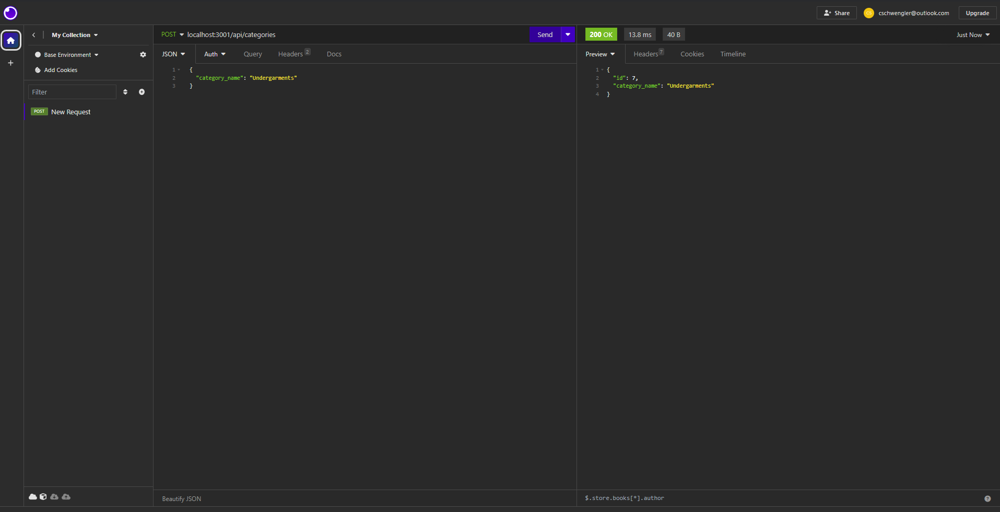
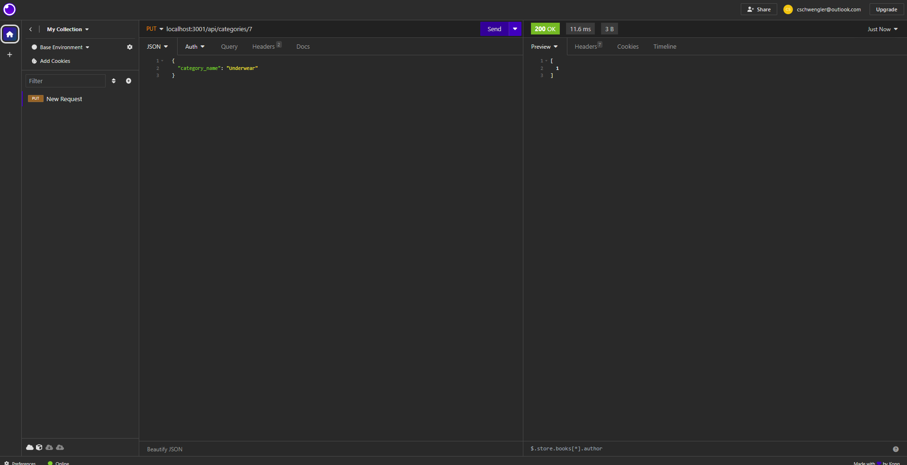
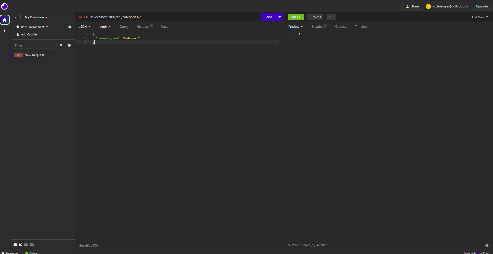

# ORM_E_Commerce

# Video link for Application:
https://drive.google.com/file/d/1lQbPYwYp6zxtnRXd8HAN_KabYh6LLbmO/view

# Project Description:
This Project is designed to create a functioning e-commerce website database to show, update information, delete information, and post new informtion in the database.

To start the project, open the terminal. Once open enter your mysql username and password. Once you are in mysql SOURCE db/schema.sql. Then Quit mysql as the database has been uploaded. Type node seeds in the terminal to seed the database with the current products etc. once the database has been deplyed Type node server into the terminal. The Company Database will be live and usable. The server now being live can be inspected by the Application Insomnia. In Insomia you can get the current information to any of the products, categories, and tags by general or a specific id. You may update using the Put method, Delete by using the deleted method, and to add to the database using the Post method.

# Javascript File:
Started with starter code. Started with connecting the server with the database. once database is connected, started on routes folder to ensure the server had the proper routes for use in insomnia. After the routes i finished the models folder which included the database information.

# DB Folder:
Inputed starter code for sql file schema. Schema files is where the database is created with tables to represent the company.

# Github:
Pushed out DB file, Javascript files, Images, and README when finishing any coding edits, as to ensure I could go back at anytime to earlier designs if need be.

# Project is located at this URL:
https://github.com/Rounderr21/ORM_E_Commerce

# Screenshot of the Project:

